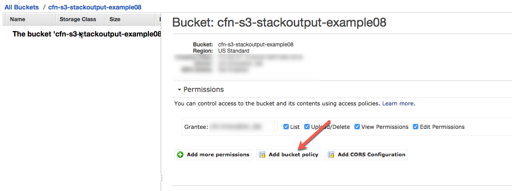
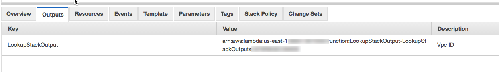
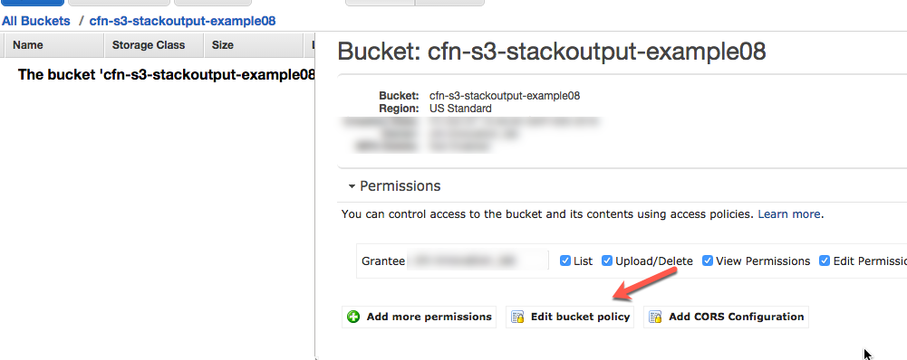
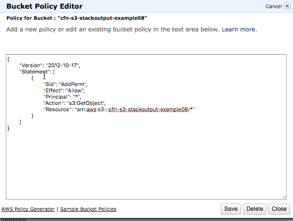

# Goal

- To be able to build layers of AWS infrastructure using cloudformation templates
- Demonstrate the ability to refer to output of one stack in another.

## Step 1:

- Run LookupStackOutput.json to create a stack that creates a lambda function

```
aws cloudformation create-stack --stack-name "LookupStackOutput" --template-body file://$PWD/templates/LookupStackOutput.json --capabilities CAPABILITY_IAM
```

## Step 2:

- Run stack1.json to create a stack that creates an s3 bucket

- Note: You will have to add output to your stack to be able to refer in another stack

```
aws cloudformation create-stack --stack-name  "stack1-test" --template-body file://$PWD/templates/stack1.json --parameters file://$PWD/params/stack1.json
```



## Step 3:

- Obtain the lambda function ARN from the output 
- Update params/stack2.json with the name of the stack you want to refer and the lambda function ARN
- Run stack2.json that obtains the name of the s3 bucket from stack 1 and apply policy

```
aws cloudformation create-stack --stack-name  "stack2-test" --template-body file://$PWD/templates/stack2.json --parameters file://$PWD/params/stack2.json
```

 
